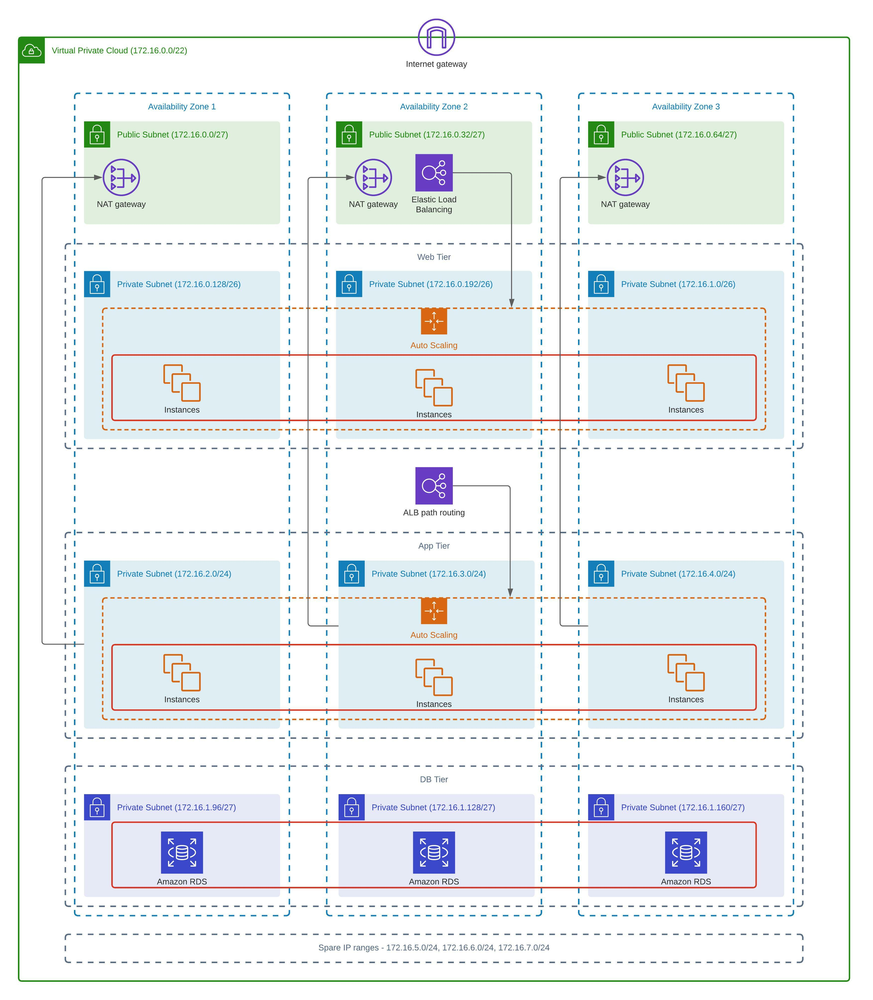

# Three-tier architecture

Diagram below shows a simple three-tier architecture that consists of Web-tier, App-tier and DB-tier. This system span across 3 availability zones.

## Summary

* The public subnet is used to store bastion host instances, which serve as a jump host to the instances at app-tier subnet and web-tier subnet.

* The web-tier subnet is used to accomodate EC2 instances that serves static front-end web contents. The EC2 inside will communicate with app-tier subnet's EC2 through internal ALB. Autoscaling group will help to provision more instances when there is a spike on CPU utilization.

* The app-tier subnet is used to accomodate EC2 instances that serves business logic apps. The EC2 will receive request from instances in web-tier subnet's EC2 through internal ALB.

* The DB-tier subnet is used to accomodate database instances. 

## Build sequence

1. `networking/`
2. `lb/`
3. `db/`
4. `web/`
5. `app/*`

## Pre-requisites

* Ubuntu or WSL2

* Terraform v1.0.6 (https://releases.hashicorp.com/terraform/1.0.6/)

* Terraform-docs (https://github.com/terraform-docs/terraform-docs)

* Pre-commit (https://pre-commit.com/#install), be sure to run `pre-commit install`.